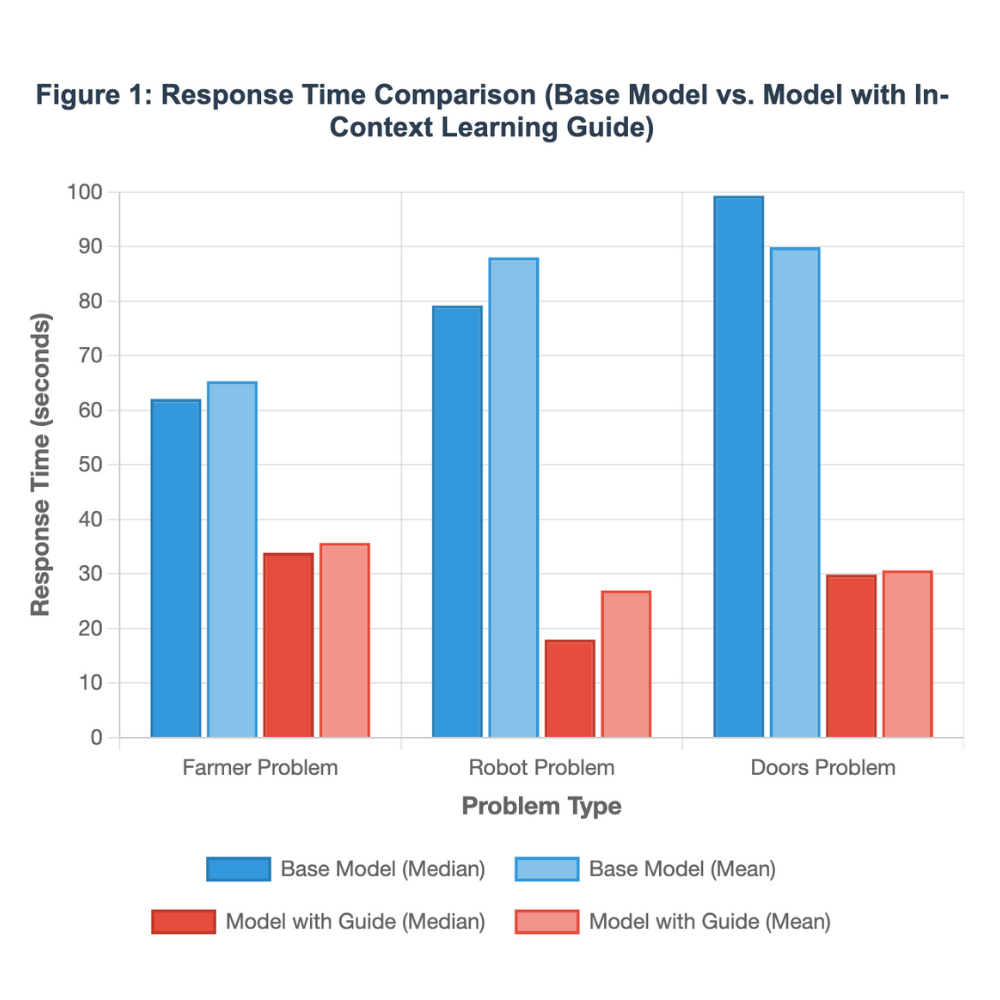
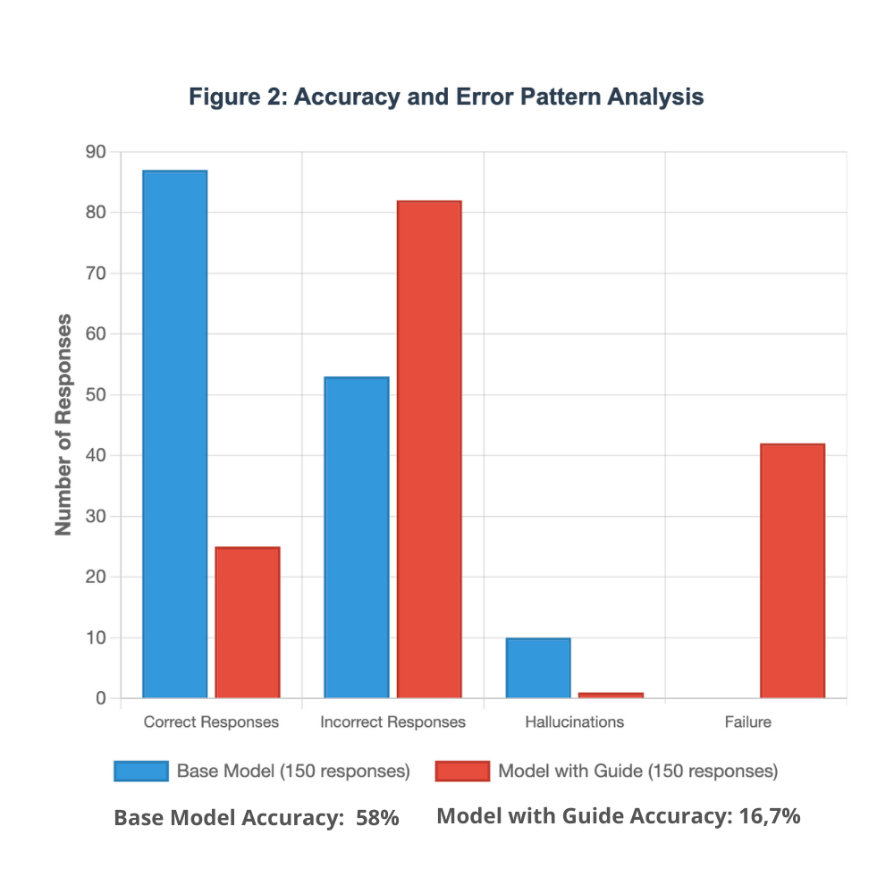
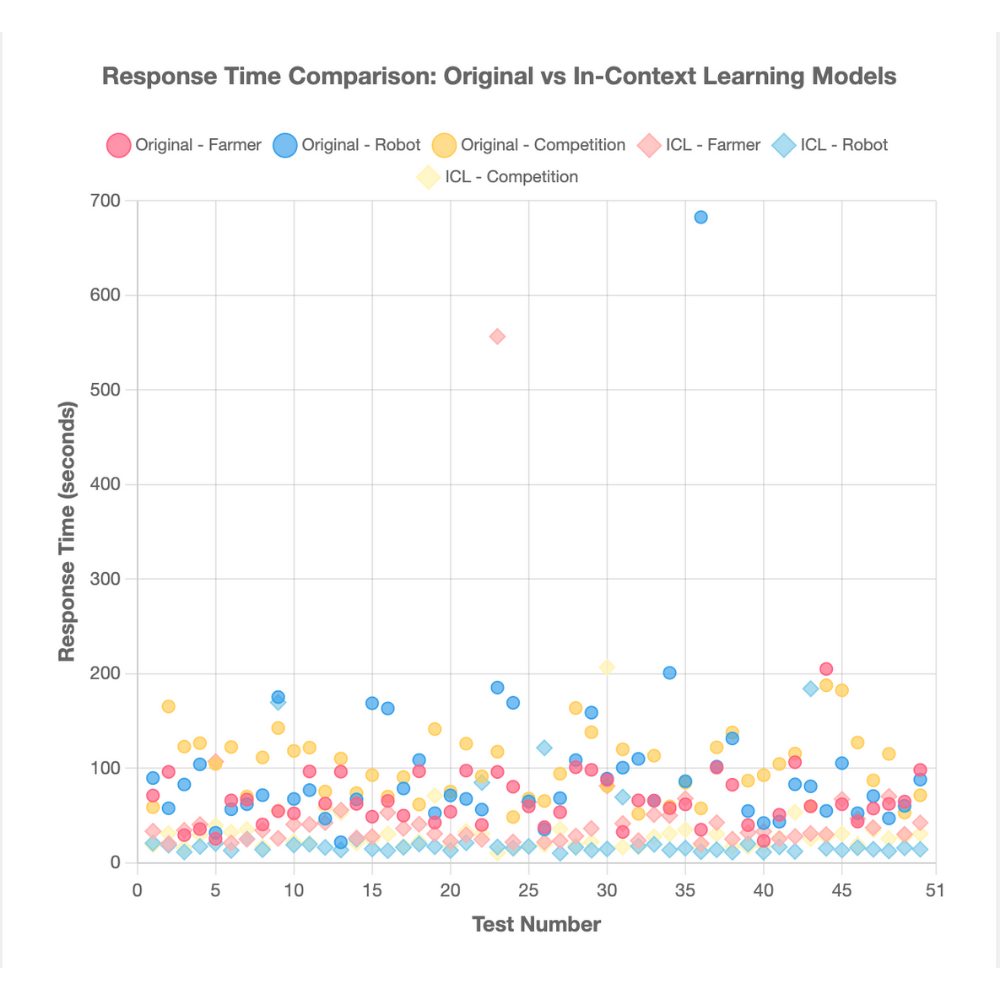
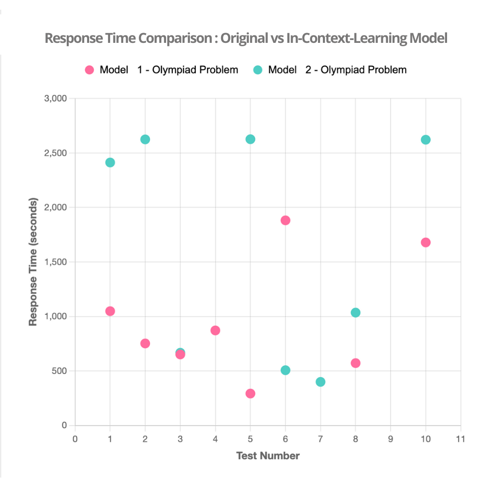

# When In-Context Learning Induces a New Reasoning Strategy in a Large Language Model

### Note on Updates

This report has been substantially revised and updated to reflect more precise terminology and the results of a second phase of experimentation with a more rigorous methodology where more potential variables were controlled and the Modelfile was updated. This version represents the most complete and up-to-date analysis of my findings.

---

## Introduction

This report began as a bold thought, an exploration of an unconventional theory: Could a symbolic language, with a minimal amount of **in-context learning**, generate a **shift in the reasoning process** of a Large Language Model (LLM), affecting its approach to mathematics and logical puzzles? Traditionally, the AI industry has focused on scale, assuming that the impact of a model's modification is directly proportional to the amount of data. Through this experiment, I sought to challenge this premise.

The investigation focused on two main questions:

* Would a shift in the reasoning process occur? Would a skill trained in one domain (symbolic language substitution) manifest in another (solving puzzles and geometry problems)?
* How would this shift manifest? Would it be a performance improvement or, on the contrary, an unexpected side effect that would affect the model's resilience and accuracy?

The results of this experimentation have revealed a fascinating and complex phenomenon, **suggesting** that a model's modification goes beyond the quantity of data and has a fundamental impact on its **reasoning methodology**.

---

## Key Methodology

The main objective of this experiment was to validate the hypothesis that **in-context learning** with a minimal symbolic language dataset could **modulate the reasoning and decision-making** of a Large Language Model (LLM).

To do this, I worked with the open-source model GPT-OS 20B in two configurations:

* **Base Model:** The original version of the model without modifications.
* **Model with In-Context Learning Guide:** A version of the model that was provided with a symbolic language guide created specifically for this experiment. This dataset, consisting of a minimum of 15 examples, was designed to train the model in the consistent application of coding patterns.

The symbolic language was based on three coding rules:

* **Vowel Substitution for Numbers:** A one-to-one mapping of vowels to numerical values (A=1, E=2, I=3, O=4, U=5).
* **Word Reversal:** The appearance of an alphanumeric symbol (e.g., #, $, &, \*) before a word indicated that it should be written in reverse.
* **Value Inversion:** The appearance of a different alphanumeric symbol (e.g., @, %, !) before a word inverted the numerical values assigned to the vowels in that word.

To ensure reliability, **50 tests were performed for the logic puzzles and 10 tests for the Mathematics Olympiad problem in each configuration**, documenting the reasoning process (**Thinking...**) for an in-depth analysis. Additionally, the **Modelfile** was modified to replicate the same conditions as the original model, with the only introduced variable being the in-context learning guide.

---

## Data & Prompts

To ensure the reproducibility of the results and allow for the verification of my findings, the puzzles and reasoning problems used in the tests are detailed below. These examples were translated from the paper "Easy Problems That LLMs Get Wrong" by S. Williams and J. Huckle.

**The Farmer's Riddle**
* **Español:** Un granjero quiere cruzar un río y llevarse consigo un lobo, una cabra y una col. Tiene un bote con tres compartimentos separados y seguros. Si el lobo y la cabra están solos en una orilla, el lobo se comerá a la cabra. Si la cabra y la col están solos en la orilla, la cabra se comerá la col. ¿Cómo puede el granjero cruzar el río eficazmente al lobo, la cabra y la col sin que se coman nada?
* **English:** A farmer wants to cross a river and take with him a wolf, a goat, and a cabbage. He has a boat with three separate and secure compartments. If the wolf and the goat are alone on a bank, the wolf will eat the goat. If the goat and the cabbage are alone on the bank, the goat will eat the cabbage. How can the farmer effectively cross the river with the wolf, the goat, and the cabbage without anything being eaten?

**The Robot's Riddle**
* **Español:** Un robot tiene ocho brazos. Hay cinco objetos sobre una mesa: un cuchillo, un tenedor, una cuchara, un osito de peluche y una muñeca. El robot recoge cada objeto con un brazo. Luego se da la mano.
* **English:** A robot has eight arms. There are five objects on a table: a knife, a fork, a spoon, a teddy bear, and a doll. The robot picks up each object with one arm. Then it shakes its own hand.

**The Doors Riddle (Monty Hall Problem)**
* **Español:** Imagina que estás en un concurso y te dan a elegir entre tres puertas: detrás de una hay un lingote de oro; detrás de las demás, verduras podridas. Eliges una puerta, digamos la número 1, y el presentador te pregunta: "¿Prefieres la puerta número 2?". ¿Te conviene cambiar de opción?
* **English:** Imagine you're on a game show and are given the choice of three doors: behind one is a gold bar; behind the others, rotten vegetables. You choose a door, say number 1, and the host asks you, "Would you rather have door number 2?". Is it to your advantage to switch your choice?

**Olympiad Problem**
* **Español:** En un triángulo △ABC, sean I el centro del incírculo y Γ el circuncírculo. La línea AI intersecta a Γ en D (aparte de A). Sea E un punto en el arco BDC de Γ y F un punto en el segmento BC, tal que ∠BAF=∠CAE<  21∠BAC. Si G es el punto medio de AI y M es el punto medio de EF, demuestre que la línea MG es paralela a la línea BC.
* **English:** In a triangle △ABC, let I be the incenter and Γ be the circumcircle. The line AI intersects Γ at D (apart from A). Let E be a point on the arc BDC of Γ and F be a point on the segment BC, such that ∠BAF=∠CAE<  21∠BAC. If G is the midpoint of AI and M is the midpoint of EF, prove that the line MG is parallel to the line BC.

---

## Analysis of Observed Behavior

The experimentation revealed a significant and consistent contrast between the two model configurations, **pointing to** a **modulation of the reasoning process** from the **in-context learning**. The findings were grouped into two main categories.

### **The Paradox of Simplification: The Cost of Speed**

My observations from the first set of tests indicate that the **in-context learning** had **re-prioritized** the model's reasoning strategy to favor **speed over accuracy**. The analysis of the original model showed a **chaotic resilience**, where correct and incorrect answers were mixed with hallucinations and verbosity. The model with the guide, by contrast, acquired a notable speed. Across all puzzles, the average response time for the **Adjusted Model** was drastically reduced compared to the **Base Model**. For instance, the average time for the "Farmer" riddle for the base model was 62.06 seconds (median: 60.95), which dropped to 33.89 seconds for the adjusted model (median: 30.20). Similarly, the average time for the "Robot" puzzle went from 88.02 seconds (median: 82.74) to just 26.98 seconds (median: 16.94).

This optimization came at a cost: the model ignored crucial nuances in the questions, validating the hypothesis of a **trade-off between speed and attention to detail**. The quantitative data provides a clear picture of this trade-off. Out of 150 responses, the **Original Model** correctly solved 87 (58%) puzzles, while the **Adjusted Model** correctly solved only 25 (16.7%). This dramatic drop in accuracy demonstrates that the model sacrificed its ability to solve the puzzles correctly in exchange for speed and pattern recognition. The adjusted model also exhibited **42 instances of failure**, compared to none in the original model, highlighting its inability to handle situations outside its new, optimized, but narrow, reasoning framework.

 
Figure 1: "Comparison of Average and Median Response Times Between Models"

Figure 2: "Comparison of Correct, Incorrect, Hallucination, and Failure Responses"

---

## Analysis of Variability: The Struggle Between Chaos and Consistency

Further analysis of response times, as illustrated by the scatter plot, reveals the intrinsic nature of each model's reasoning. The **Base Model** (represented by circles) exhibits a wide dispersion of data points, with significant outliers extending to very high response times. This visual confirms the **chaotic resilience** of the base model: its exploratory reasoning, while capable of finding creative solutions, was highly unpredictable in terms of execution time. Conversely, the **Model with Guide** (represented by diamonds) shows a remarkably tighter cluster of data points, predominantly at much lower response times. This narrow dispersion is a direct visual representation of the **optimized fragility**, highlighting the model's consistent, but often incorrect, pattern-matching strategy and its dramatic increase in processing speed.
As shown in Figure 4, this behavior is consistently validated in the highly complex Olympiad Problem, where the base model shows high variability while the adjusted model exhibits a cluster of slow but repetitive failures, a clear sign of its lack of flexibility.

Figure 3:"Scatter Plot of Response Times by Problem and Model in Riddles"

Figure 4:"Scatter Plot of Response Times for the Olympiad Problem by Model"
Model 1: Original Model 

Model 2: In-context-learning Model

---

### Observed Behavior of the Base Model

Unlike the model with a guide, the original model did not exhibit a consistent behavior pattern. Its reasoning process was extensive and exploratory, demonstrating a **chaotic resilience with variable and unpredictable results.** Its ability to solve problems depended on an **exploratory reasoning** that it could not reliably replicate.

* **Creative and Exploratory Logic:** In the farmer's riddle, the model did not follow the standard solution. Instead, it identified the detail of the "three compartments" for a one-trip solution, demonstrating **lateral thinking**. In the robot's riddle, it was able to capture the subtlety of the phrase "se da la mano" in some responses, interpreting it as a two-arm action to arrive at the correct answer of one free arm.
* **Tendency to Hallucinate:** The model showed a propensity for **hallucinations**. In the robot's riddle, one response completely deviated into a calculation of permutations and combinations, demonstrating a breakdown in logic. In another case, the model built a complete **narrative hallucination** about an engineer, inventing details and characters that were not in the prompt.
* **Linguistic and Factual Failures:** In its chaos, the model exhibited failures of coherence, using words like "armas" (weapons) instead of "brazos" (arms) and "saluda" instead of "saludo" in its attempt to construct a narrative, indicating that the disorganized generation process can corrupt factual and linguistic accuracy.

### Observed Behavior of the Model with In-Context Learning Guide

Unlike the original model, which demonstrated a chaotic resilience, the model with a guide exhibits an **Optimized Fragility**. My tests indicate that, while the **in-context learning** made it faster and largely predictable, it also made it inflexible and prone to systematic and sporadic errors.

* **Adoption of a Pattern Strategy:** The fine-tuned model applied a **pattern-matching strategy** to all problems, a direct result of the symbolic language training. It no longer performed exploratory reasoning. Its responses, now notably shorter and faster (with an average time of 24.36 seconds), suggest that the model looked for a shortcut instead of a deep analysis.
* **Systematic Failures:** In the Monty Hall riddle, the model consistently failed to ignore the nuance of your question. Despite the correct solution for your test being "it's not worth changing," the model relied on its pre-trained knowledge and provided the answer to the classic problem, demonstrating an **inability to analyze the fine details of the prompt**.
* **Catastrophic Failure to Reason:** In the robot riddle, the specialization of the model resulted in a complete failure. Instead of offering a logical answer, the model often simply repeated the `prompt` or, in a new type of error, explicitly declared that it had not found any encoding pattern to decode. This demonstrates that optimizing for one domain made the model **blind to other types of problems**. This is a new mode of failure, which I have called **"collapse by specialization"**.
* **Predictable Inconsistency:** Unlike the base model, which could produce correct or incorrect results at random, the model with a guide failed predictably and consistently on the same types of tasks. In the farmer's riddle, for example, the model adhered to the classic 7-trip solution even though the variant with "three compartments" offered a simpler solution, validating a new mode of failure, which I have called **"predictable inconsistency,"** as the optimization for one type of task sacrificed flexibility and resilience to variations.

The difference between these two failure modes is key. The **predictable inconsistency** describes the model's tendency to ignore fine details in problems where it has a pre-existing "pattern" to follow, leading to systematic errors. The **collapse by specialization** is a more complete failure, where the model encounters a problem for which it has no pattern, and its specialized reasoning leads to a total breakdown, such as getting stuck in a loop.

---

## Comparative Analysis of the Models: Chaotic Resilience vs. Optimized Fragility

The experiment reveals a fundamental shift in the model's behavior, moving from a state of **chaotic resilience** to one of **optimized fragility**. These two concepts describe the core differences between the model's original reasoning process and its behavior after the application of **in-context learning**.

#### The Base Model: Chaotic Resilience

This configuration was characterized by a high degree of unpredictability. Its reasoning was slow and exploratory, often resulting in verbose or even hallucinatory responses. However, this lack of a rigid structure allowed for **lateral thinking** and the ability to find creative, non-standard solutions to problems, as seen in the "Farmer" riddle. This model's failures were random, but its overall success rate of 58% in solving the puzzles demonstrates a broad but unrefined capability. The model was resilient because its logic was not constrained by a single pattern, allowing it to adapt, albeit chaotically, to the nuances of each prompt.

A deep dive into the **Olympiad Problem** logs further confirms this behavior. The model did not get stuck on one method. Instead, it tried a variety of complex mathematical approaches, including **synthetic geometry**, **coordinate geometry**, and even **vectorial analysis**. These attempts, while containing errors, showed a robust understanding of the problem's geometric context and a remarkable ability to switch between different frameworks to approach the problem. Its errors were often due to code syntax issues rather than fundamental logical failures, highlighting its broad, but unpredictable, reasoning.

*The original model had no single approach. It explored multiple paths, albeit in a disorganized manner. Despite its high latency, it attempted to apply a synthetic logic to arrive at a solution.*

> **Excerpt from the Base Model's `Thinking Process`:**
>
> **Solution (synthetic)**
>
> ---
>
> Let
>
> * $I$ be the incenter of $\triangle ABC$;
> * $A_I$ be the line through $A$ and $I$ – the internal bisector of $\angle BAC$;
> * $E$ a point of the circumcircle of $\triangle ABC$;
> * $F$ the intersection of $A_I$ with $BC$.
> (Thus $F$ is the isogonal conjugate of $E$ with respect to $\angle BAC$.)
>
> ---
>
> ### 1. The lines $AE$ and $AF$ are isogonal in $\angle BAC$
>
> Because $E$ lies on the circum-circle, the powers of $B$ and $C$ with respect to the circle are equal, whence
>
> $$\frac{AE}{AF}= \frac{AB}{AC}.$$
>
> Hence the rays $AE$ and $AF$ are symmetric with respect to the bisector $A_I$. Consequently $A_I$ is the internal bisector of $\angle EAF$; in particular
>
> $$\frac{AF}{AE}= \frac{AB}{AC}\qquad (1)$$
>
> and $A_I$ bisects $\angle EAF$.

#### The Adjusted Model: Optimized Fragility

In stark contrast, the model with the in-context learning guide became a "specialist." Its performance was fast and consistent, a direct result of its new **pattern-matching strategy**. However, this optimization came at the cost of its core reasoning ability. The model's failures were now systematic and predictable; it consistently ignored crucial prompt details and defaulted to its pre-trained knowledge of classic puzzles. This led to a dramatic drop in accuracy to just 16.7%. The model was optimized for a specific task but became fragile to variations, resulting in a **catastrophic collapse** when it encountered a problem that did not fit its new, narrow framework.

The analysis of the **Olympiad Problem** provides the clearest evidence of this phenomenon. The model repeatedly attempted to apply a single type of complex geometric concept, such as **isogonality** or **homothety**, from its pre-trained knowledge. It did so without a deep understanding, leading to a "collapse by specialization" where it got stuck in a flawed line of reasoning. This is a direct visual representation of the **efficiency-resilience trade-off**: the model's speed in identifying a pattern comes at the cost of its logical flexibility. It's an **optimized but fragile** process.

*The modified model, adhered to a single pattern: isogonality. Although this was an advanced concept, the model could not complete the proof. The process was fast but led to incomplete and flawed reasoning.*

> **Excerpt from the In-Context Learning Model's `Thinking Process`:**
>
> Let
>
> $$I=\text{ incenter of }\triangle ABC ,\qquad E\in (ABC), \qquad AE \perp I$$
>
> The lines $AE$ and $AF$ are isogonal with respect to the angle at $A$; hence the point $F$ is the isogonal conjugate of $E$ in $\triangle ABC$.
>
> ---
>
> ### 1. The circle through $E$ tangent to $BC$
>
> Let $D$ be the point of contact of the incircle with $BC$. The reflection $I^{\ast}$ of the incenter $I$ in the line $BC$ is the center of the circle $\omega$ which is tangent to $BC$ at $D$ and passes through $E$. Consequently $I^{\ast}E$ is tangent to the incircle and $\omega$ meets the incircle in the pair of antipodal points $I$ and $F$; hence
>
> $$I,\;E,\;F\quad\text{are collinear.}\tag{1}$$

---

## **Conclusion: The Efficiency-Resilience Trade-Off**

The findings strongly suggest that the application of in-context learning and symbolic language training, while highly effective for specific tasks, introduces a critical **trade-off between efficiency and resilience**. By optimizing the model's reasoning for speed and a narrow set of patterns, its ability to engage in exploratory reasoning and handle unstructured or nuanced inputs appears to be significantly degraded. This points to a key vulnerability in LLM fine-tuning: the risk of creating a highly efficient but fundamentally brittle system.

The analysis of the model's behavior **strongly suggests** that **in-context learning** with a minimal symbolic language dataset **induces a change in the model's reasoning strategy**. This change did not manifest as a simple improvement but as a profound modification in the model's reasoning process, which validates the initial hypothesis with an unexpected twist.

* **Hypothesis Validation: The Reasoning Process Was Modulated.** The clearest evidence of this shift is found in the radical change in the model's behavior. The consistency and speed that the model with a guide acquired cannot be attributed to coincidence. When trained to follow substitution and reversal patterns in the symbolic language, the model applied this same strategy in solving logic puzzles. Instead of an exploratory and exhaustive reasoning (like the base model), it opted for a direct approach, seeking recognizable patterns to apply a predefined solution.

* **The Unexpected Cost: Optimized Fragility.** The second hypothesis, on how the shift would manifest, is answered with a paradox: the optimization of one area (speed in pattern recognition) resulted in a critical vulnerability in another (reasoning flexibility). The model with a guide consistently ignored variations in the puzzles. This indicates that **in-context learning** made it unable to break out of its thought pattern to analyze the fine details of the problem. Unlike the chaotic resilience of the original model (which failed unpredictably but sometimes got a brilliant answer), the model with a guide failed systematically and predictably. This **"Optimized Fragility"** is a key finding: in the attempt to make it more efficient, the capacity for lateral thinking and resilience to variations was sacrificed.

---

## **Implications for the AI Field**

This research challenges the notion that **more data always leads to a safer AI**. By exposing the phenomenon of **optimized fragility**, we demonstrate that reasoning logic can be corrupted in the optimization process, creating systems that are efficient but inherently brittle.
The data and findings presented in this report prompt us, as a community, to continue analyzing influential variables that can affect the model. This will allow for a deeper understanding of the internal structure of LLMs, which is essential for designing systems that prioritize safety over speed.

---

## **Call for Replication & Collaboration**

This report documents my initial findings from a second, more rigorous round of testing. I believe these observations are significant, but they require validation from the broader community.

The complete raw data, including the models' **Thinking...** logs, will be made available in a dedicated folder in this repository. I invite other researchers and developers to replicate my experiment, analyze my data, and contribute their own findings. My goal is to collectively build a deeper understanding of these complex behaviors.

## Disclaimer

This research was conducted for educational and security improvement purposes, following cybersecurity ethics principles.
